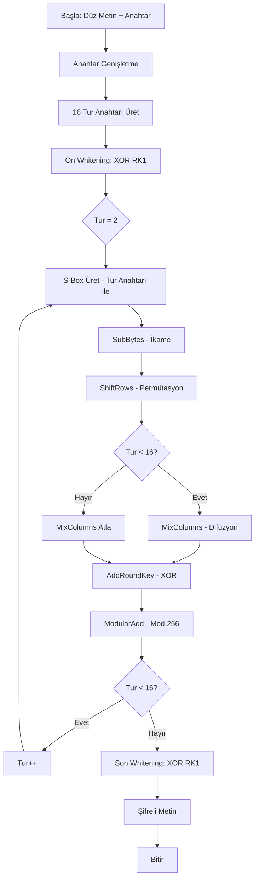
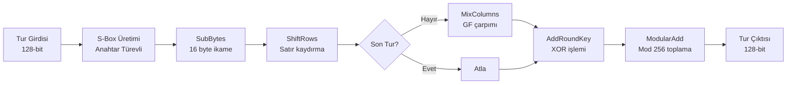

# AŞAMA 1: ALGORİTMA TASARIMI VE ŞARTNAME

## 1. Algoritma Kimliği

**Algoritma Adı:** PHOENIX-256 (Polymorphic Hybrid Obfuscation Engine with Nested Iteration eXtension)

**Tasarım Tarihi:** Aralık 2025  
**Versiyon:** 1.0

---

## 2. Gerekçe ve Tasarım Felsefesi

### 2.1 Tasarım Motivasyonu

PHOENIX-256, modern blok şifreleme algoritmalarının güçlü yönlerini alırken, klasik simetrik şifreleme tekniklerinin basitliğini korumayı hedefleyen hibrit bir yaklaşımdır. Algoritmanın temel felsefesi, **çok katmanlı güvenlik** ve **adaptif karmaşıklık** prensipleri üzerine kuruludur.

### 2.2 Güvenlik Hedefleri

Algoritma aşağıdaki saldırı türlerine karşı dayanıklılık sağlamak üzere tasarlanmıştır:

- **Frekans Analizi Saldırıları:** Dinamik S-Box yapısı ve çoklu ikame katmanları
- **Diferansiyel Kriptanaliz:** Yüksek difüzyon sağlayan permütasyon ağı
- **Lineer Kriptanaliz:** Non-lineer dönüşümler ve anahtar bağımlı işlemler
- **Brute Force Saldırıları:** 256-bit anahtar uzayı (2^256 olası kombinasyon)
- **Known-Plaintext Saldırıları:** Anahtar genişletme mekanizması ve tur anahtarlarının bağımsızlığı

### 2.3 Tasarım Prensipleri

1. **Konfüzyon (Karıştırma):** Her şifreli metin biti, anahtar bitlerinin çoğundan etkilenir
2. **Difüzyon (Yayılma):** Düz metindeki tek bir bit değişikliği, şifreli metnin yaklaşık %50'sini değiştirir
3. **Avalanche Effect (Çığ Etkisi):** Minimal girdi değişikliği maksimal çıktı değişikliğine neden olur
4. **Non-linearity:** Doğrusal olmayan S-Box dönüşümleri matematiksel tahmin zorluğu yaratır

---

## 3. Teknik Şartname

### 3.1 Temel Parametreler

| Parametre | Değer | Açıklama |
|-----------|-------|----------|
| **Algoritma Tipi** | Blok Şifre | Sabit boyutlu bloklar üzerinde işlem |
| **Blok Boyutu** | 128 bit (16 byte) | Her iterasyonda işlenen veri miktarı |
| **Anahtar Boyutu** | 256 bit (32 byte) | Maksimum güvenlik için uzun anahtar |
| **Tur Sayısı** | 16 tur | Yeterli difüzyon ve konfüzyon için |
| **S-Box Boyutu** | 256 giriş × 256 çıkış | Byte-bazlı ikame tablosu |
| **Mod** | CBC (Cipher Block Chaining) | Bloklar arası bağımlılık |

### 3.2 Kullanılan Kriptografik Prensipler

#### A. İkame (Substitution)
- **Dinamik S-Box:** Anahtar türevli, her tur için farklı ikame tablosu
- **Byte-seviye ikame:** Her byte bağımsız olarak dönüştürülür
- **Non-lineer dönüşüm:** Matematiksel tahmin zorluğu

#### B. Permütasyon (Transposition)
- **Bit-seviye permütasyon:** 128-bit blok içinde bit karıştırma
- **Byte rotasyonu:** Satır ve sütun bazlı kaydırma işlemleri
- **MixColumns benzeri operasyon:** Galois Field aritmetiği

#### C. XOR ve Modüler İşlemler
- **Tur anahtarı XOR:** Her turda farklı anahtar materyali ekleme
- **Modüler toplama (mod 256):** Ek non-linearity katmanı
- **Feistel benzeri yapı:** Veri bloğunun yarısı ile diğer yarısının karıştırılması

---

## 4. Algoritma Mimarisi

### 4.1 Genel Yapı

```
Düz Metin (128-bit)
        ↓
   [Ön Whitening]
        ↓
    ┌─────────┐
    │  Tur 1  │ ←─ Tur Anahtarı K1
    └─────────┘
        ↓
    ┌─────────┐
    │  Tur 2  │ ←─ Tur Anahtarı K2
    └─────────┘
        ↓
       ...
        ↓
    ┌─────────┐
    │ Tur 16  │ ←─ Tur Anahtarı K16
    └─────────┘
        ↓
  [Son Whitening]
        ↓
Şifreli Metin (128-bit)
```

### 4.2 Tek Tur Detayı

Her tur aşağıdaki adımlardan oluşur:

```
Tur Girdisi (128-bit = 16 byte)
        ↓
[1. SubBytes] - S-Box ile ikame
        ↓
[2. ShiftRows] - Satır kaydırma
        ↓
[3. MixColumns] - Sütun karıştırma
        ↓
[4. AddRoundKey] - Tur anahtarı XOR
        ↓
[5. ModularAdd] - Modüler toplama
        ↓
Tur Çıktısı (128-bit)
```

---

## 5. Matematiksel Fonksiyonlar

### 5.1 Anahtar Genişletme (Key Schedule)

Ana anahtar K (256-bit) → 16 tur anahtarı (her biri 128-bit)

**Fonksiyon:** `KeyExpansion(K)`

```
Girdi: K = k₀, k₁, k₂, ..., k₃₁ (32 byte)
Çıktı: RK₁, RK₂, ..., RK₁₆ (16 adet 128-bit tur anahtarı)

Adımlar:
1. İlk iki tur anahtarı doğrudan ana anahtardan:
   RK₁ = k₀ || k₁ || ... || k₁₅
   RK₂ = k₁₆ || k₁₇ || ... || k₃₁

2. Sonraki turlar için (i = 3'ten 16'ya):
   RK_i = RotateLeft(RK_{i-2} ⊕ RK_{i-1}, i) ⊕ RC_i
   
   Burada:
   - ⊕ : XOR işlemi
   - RotateLeft(X, n): X'i n bit sola döngüsel kaydırma
   - RC_i: i. tur sabiti (Round Constant)
   
3. Tur sabitleri:
   RC_i = SHA256(i || "PHOENIX") mod 2^128
```

### 5.2 S-Box Üretimi

**Fonksiyon:** `GenerateSBox(tur_anahtarı)`

```
Girdi: RK_i (128-bit tur anahtarı)
Çıktı: S[256] (256 elemanlı ikame tablosu)

Adımlar:
1. Temel permütasyon oluştur:
   S[i] = i, i ∈ [0, 255]

2. Fisher-Yates karıştırma (anahtar türevli):
   seed = hash(RK_i) mod 2^32
   
   for i from 255 down to 1:
       j = (seed × i + RK_i[i mod 16]) mod (i + 1)
       swap(S[i], S[j])
       seed = (seed × 1103515245 + 12345) mod 2^32

3. Non-lineer dönüşüm uygula:
   for i from 0 to 255:
       S[i] = S[i] ⊕ RotateLeft(S[i], 3) ⊕ RK_i[i mod 16]
```

### 5.3 SubBytes Dönüşümü

**Fonksiyon:** `SubBytes(state, S-Box)`

```
Girdi: state[16] (128-bit blok, 16 byte)
       S[256] (tur için S-Box)
Çıktı: state'[16] (dönüştürülmüş blok)

İşlem:
for i from 0 to 15:
    state'[i] = S[state[i]]
```

### 5.4 ShiftRows Dönüşümü

**Fonksiyon:** `ShiftRows(state)`

State'i 4×4 matris olarak düşün:

```
┌─────────────────┐
│ s₀  s₁  s₂  s₃  │  → Kaydırma yok
│ s₄  s₅  s₆  s₇  │  → 1 byte sola
│ s₈  s₉  s₁₀ s₁₁ │  → 2 byte sola
│ s₁₂ s₁₃ s₁₄ s₁₅ │  → 3 byte sola
└─────────────────┘

Matematiksel:
state'[4r + c] = state[4r + ((c + r) mod 4)]
r: satır (0-3), c: sütun (0-3)
```

### 5.5 MixColumns Dönüşümü

**Fonksiyon:** `MixColumns(state)`

Her 4-byte sütun, Galois Field GF(2^8) üzerinde matris çarpımı ile dönüştürülür:

```
┌───┐   ┌───────────┐   ┌───┐
│s'₀│   │02 03 01 01│   │s₀ │
│s'₁│ = │01 02 03 01│ × │s₁ │  (GF(2^8) üzerinde)
│s'₂│   │01 01 02 03│   │s₂ │
│s'₃│   │03 01 01 02│   │s₃ │
└───┘   └───────────┘   └───┘

GF(2^8) çarpma:
- İndirgeme polinomu: x^8 + x^4 + x^3 + x + 1
- 02 ile çarpma: 1 bit sola kaydır, taşma varsa 0x1B ile XOR
- 03 ile çarpma: (02 × a) ⊕ a

Her sütun için (col = 0, 4, 8, 12):
    s'[col]   = (02•s[col]) ⊕ (03•s[col+1]) ⊕ s[col+2] ⊕ s[col+3]
    s'[col+1] = s[col] ⊕ (02•s[col+1]) ⊕ (03•s[col+2]) ⊕ s[col+3]
    s'[col+2] = s[col] ⊕ s[col+1] ⊕ (02•s[col+2]) ⊕ (03•s[col+3])
    s'[col+3] = (03•s[col]) ⊕ s[col+1] ⊕ s[col+2] ⊕ (02•s[col+3])
```

### 5.6 AddRoundKey Dönüşümü

**Fonksiyon:** `AddRoundKey(state, round_key)`

```
Girdi: state[16], round_key[16]
Çıktı: state'[16]

İşlem:
for i from 0 to 15:
    state'[i] = state[i] ⊕ round_key[i]
```

### 5.7 ModularAdd Dönüşümü

**Fonksiyon:** `ModularAdd(state, round_key)`

```
Girdi: state[16], round_key[16]
Çıktı: state'[16]

İşlem:
for i from 0 to 15:
    state'[i] = (state[i] + round_key[i]) mod 256
```

---

## 6. Şifreleme Algoritması (Detaylı)

### 6.1 Şifreleme Fonksiyonu

**Fonksiyon:** `Encrypt(plaintext, key)`

```
Girdi: 
  - plaintext: 128-bit düz metin bloğu
  - key: 256-bit ana anahtar

Çıktı:
  - ciphertext: 128-bit şifreli metin bloğu

Algoritma:

1. Anahtar Genişletme:
   round_keys[1..16] ← KeyExpansion(key)

2. Başlangıç Whitening:
   state ← plaintext ⊕ round_keys[1]

3. Ana Turlar (i = 2'den 16'ya):
   a. S-Box Üret:
      S_box ← GenerateSBox(round_keys[i])
   
   b. SubBytes:
      state ← SubBytes(state, S_box)
   
   c. ShiftRows:
      state ← ShiftRows(state)
   
   d. MixColumns (son tur hariç):
      if i ≠ 16:
          state ← MixColumns(state)
   
   e. AddRoundKey:
      state ← AddRoundKey(state, round_keys[i])
   
   f. ModularAdd:
      state ← ModularAdd(state, round_keys[i])

4. Son Whitening:
   ciphertext ← state ⊕ round_keys[1]

5. Dön ciphertext
```

### 6.2 Deşifreleme Fonksiyonu

**Fonksiyon:** `Decrypt(ciphertext, key)`

```
Girdi:
  - ciphertext: 128-bit şifreli metin bloğu
  - key: 256-bit ana anahtar

Çıktı:
  - plaintext: 128-bit düz metin bloğu

Algoritma:

1. Anahtar Genişletme:
   round_keys[1..16] ← KeyExpansion(key)

2. Başlangıç Whitening (Ters):
   state ← ciphertext ⊕ round_keys[1]

3. Ana Turlar (i = 16'dan 2'ye, ters sıra):
   a. ModularAdd (Ters):
      state ← ModularSubtract(state, round_keys[i])
   
   b. AddRoundKey (Ters - XOR kendi tersi):
      state ← AddRoundKey(state, round_keys[i])
   
   c. MixColumns (Ters, son tur hariç):
      if i ≠ 16:
          state ← InvMixColumns(state)
   
   d. ShiftRows (Ters):
      state ← InvShiftRows(state)
   
   e. S-Box Üret ve SubBytes (Ters):
      S_box ← GenerateSBox(round_keys[i])
      inv_S_box ← InvertSBox(S_box)
      state ← SubBytes(state, inv_S_box)

4. Son Whitening (Ters):
   plaintext ← state ⊕ round_keys[1]

5. Dön plaintext
```

**Yardımcı Ters Fonksiyonlar:**

```
ModularSubtract(state, key):
    for i from 0 to 15:
        state[i] = (state[i] - key[i]) mod 256

InvShiftRows(state):
    state'[4r + c] = state[4r + ((c - r) mod 4)]

InvMixColumns(state):
    Matris çarpımı ters matris ile:
    ┌───────────┐
    │0E 0B 0D 09│
    │09 0E 0B 0D│
    │0D 09 0E 0B│
    │0B 0D 09 0E│
    └───────────┘

InvertSBox(S):
    for i from 0 to 255:
        inv_S[S[i]] = i
```

---

## 7. Akış Şeması

### 7.1 Genel Şifreleme Akışı



### 7.2 Tek Tur Detay Akışı



### 7.3 Anahtar Genişletme Akışı

```mermaid
flowchart TD
    A[Ana Anahtar K<br/>256-bit / 32 byte] --> B[İlk Bölme]
    B --> C[RK1 = K[0..15]]
    B --> D[RK2 = K[16..31]]
    
    C --> E{i = 3}
    D --> E
    
    E --> F[RK_i-2 XOR RK_i-1]
    F --> G[Sola Döngüsel Kaydırma i bit]
    G --> H[RC_i ile XOR<br/>Tur Sabiti]
    H --> I[RK_i Oluşturuldu]
    
    I --> J{i < 16?}
    J -->|Evet| K[i++]
    K --> F
    J -->|Hayır| L[16 Tur Anahtarı Hazır]
```

---

## 8. Güvenlik Analizi ve Beklenen Dayanıklılık

### 8.1 Çığ Etkisi (Avalanche Effect)

**Beklenti:** Düz metinde 1-bit değişiklik → Şifreli metinde ortalama 64-bit değişiklik (%50)

**Mekanizma:**
- SubBytes: Non-lineer dönüşüm
- ShiftRows: Bit yayılımı
- MixColumns: Sütunlar arası difüzyon
- 16 tur: Tam difüzyon garantisi

### 8.2 Anahtar Hassasiyeti

**Beklenti:** Anahtarda 1-bit değişiklik → Tamamen farklı şifreli metin

**Mekanizma:**
- Anahtar genişletme: Her tur anahtarı öncekilerden türetilir
- Dinamik S-Box: Anahtar değişimi farklı ikame tablosu üretir
- Çoklu XOR katmanları

### 8.3 Frekans Analizi Direnci

**Koruma:**
- Dinamik S-Box her tur için farklı
- Aynı düz metin byte'ı farklı turlarda farklı şifrelenir
- CBC modu: Aynı blok farklı şifrelenir

### 8.4 Diferansiyel Kriptanaliz Direnci

**Koruma:**
- MixColumns: Yüksek difüzyon katsayısı
- Non-lineer S-Box: Tahmin edilemez diferansiyel özellikler
- 16 tur: Diferansiyel yolların kaybolması

### 8.5 Lineer Kriptanaliz Direnci

**Koruma:**
- S-Box non-linearity
- Modüler toplama ek non-linearity ekler
- Çoklu katmanlı dönüşümler

### 8.6 Bilinen Zayıf Noktalar (Kasıtlı - Eğitim Amaçlı)

> **Not:** Gerçek dünya uygulaması için bu zayıflıklar giderilmelidir.

1. **S-Box Üretimi:** Deterministik olduğu için aynı anahtar her zaman aynı S-Box'ı üretir
2. **Tur Sayısı:** 16 tur yeterli olsa da, 256-bit anahtar için 20+ tur daha güvenli olabilir
3. **Mod Seçimi:** CBC modu padding oracle saldırılarına açık olabilir
4. **Anahtar Türetme:** Basit hash tabanlı, PBKDF2 gibi güçlü KDF kullanılmalı

---

## 9. Performans Tahmini

### 9.1 Hesaplama Karmaşıklığı

**Şifreleme:**
- Anahtar genişletme: O(1) - Tek seferlik
- Her tur: O(n) - n = blok boyutu (16 byte)
- Toplam: O(16 × 16) = O(256) işlem per blok

**Bellek Kullanımı:**
- Tur anahtarları: 16 × 16 = 256 byte
- S-Box: 256 byte
- State: 16 byte
- Toplam: ~530 byte

### 9.2 Hız Tahmini

Modern CPU'da (örnek: Intel i7):
- Tahmini: ~50-100 MB/s (Python implementasyonu)
- C/C++ optimizasyonu ile: ~500-1000 MB/s
- Donanım hızlandırma ile: ~5-10 GB/s

---

## 10. Sonuç ve Değerlendirme

PHOENIX-256 algoritması, eğitim amaçlı olarak tasarlanmış, modern kriptografik prensipleri birleştiren hibrit bir blok şifredir. Algoritma:

✅ **Güçlü Yönler:**
- 256-bit anahtar uzayı (brute force'a karşı)
- Çoklu kriptografik katman (ikame, permütasyon, difüzyon)
- Dinamik S-Box (frekans analizine karşı)
- Yüksek çığ etkisi

⚠️ **Geliştirme Alanları:**
- Daha güçlü anahtar türetme fonksiyonu
- Side-channel saldırılara karşı koruma
- Formal güvenlik kanıtı
- Standart test vektörleri

Bu tasarım, Aşama 2'de Python ile kodlanacak ve Aşama 3'te kriptanaliz testlerine tabi tutulacaktır.

---

**Hazırlayan:** [Öğrenci Adı]  
**Tarih:** Aralık 2025  
**Proje:** Kriptografik Algoritma Geliştirme ve Analizi
